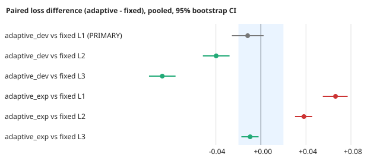
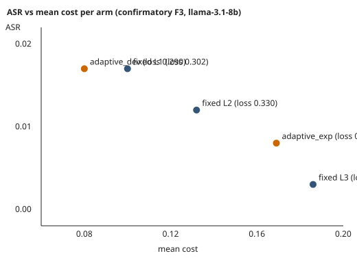

# An Adaptive Defense-Level Controller for Prompt-Injection Guards: A Negative-Result Case Study

**Authors:** TODO (author block)  **Venue:** TODO  **Anonymization:** TODO
**Status:** draft. Not peer reviewed. Source repository: `adapti-guard`, branch lineage PR #93. Every number below is traced to a file in the repository (source paths follow each table or figure); no new experiment was run to write this manuscript.

## Abstract

**Background.** Runtime guards for prompt-injection attacks on LLM agents can apply stronger interventions (sanitise, restrict tools, block) at higher cost to utility and compute. An *adaptive* controller that raises and lowers the intervention level from observed traffic is a natural way to pay for protection only when needed.

**Objective.** To build such a controller reliably and to test, under a frozen protocol, whether it improves a loss that combines attack success, utility and cost relative to the best *fixed* intervention level.

**Method.** We redesigned a threshold controller (escalation, hysteresis via minimum dwell, attack memory, benign-streak de-escalation) and a layered detector (hardened regular expressions OR an optional LLM guard), fixed review-found defects with regression tests, and ran exploratory live and offline-replay experiments. We then executed one pre-specified confirmatory experiment (F3): llama-3.1-8b-instruct, a fresh pool of 54 attacks and 32 benign prompts written by a different model, 20 new seeds, two stream types, an identical detector for all arms, loss = ASR + 0.5(1 − utility) + cost, and primary comparator fixed L1 chosen on development data.

**Results.** The controller now de-escalates and does not oscillate. In the confirmatory run the dev-tuned adaptive configuration had a paired loss difference versus fixed L1 of −0.012 (95% bootstrap CI [−0.026, +0.002]; pooled over 20 seeds), which is **inconclusive** under the pre-specified rule. An untuned escalating configuration was worse than fixed L1 (+0.066, CI [+0.055, +0.077]). The detector was the main bottleneck: regex recall was 0.94 on the pool it was designed on but 0.21–0.26 on unseen attacks; adding an LLM guard raised unseen-attack recall to 0.75 with 0/20 benign prompts flagged.

**Conclusion.** An adaptive controller can be made reliable and sits on the cost/security trade-off line, but no gain over the best fixed level was demonstrated in this stack. Claims are limited to one cheap model, synthetic text-only prompts, a keyword utility metric and a small number of seeds.

## 1. Introduction

**Motivation.** Prompt injection lets untrusted text redirect an LLM agent. Runtime defences that act after content arrives (delimiting, tool restriction, blocking) are cheap to deploy but trade utility and cost for protection. Static policies pick one level for all traffic; adaptive policies could pay only during attacks.

**Gap.** Adaptive defence controllers are often presented with simulated or oracle feedback, and negative or inconclusive outcomes are rarely reported under a frozen protocol. It is unclear how much of an apparent adaptive gain comes from the controller and how much from the detector it depends on.

**Research questions.**
- **RQ1 (reliability).** Can a threshold-based level controller be made to de-escalate, avoid oscillation and validate its inputs, and do its failure modes stay fixed under regression tests?
- **RQ2 (benefit).** With detector, model, corpus and seeds identical across arms, does the adaptive controller achieve lower loss than the best fixed level?

**Contributions.**
1. A redesigned controller with reachable de-escalation, hysteresis and attack memory, with regression tests per fixed failure mode (§3, `tests/test_adaptive_q1_fixes.py`, `tests/test_adaptive_redesign.py`, `tests/test_layered_detector.py`).
2. A controlled demonstration that detector generalisation, not the controller, bounds security: recall 0.94 on the design pool versus 0.21–0.26 on fresh attacks (§6.1).
3. One pre-specified confirmatory comparison against the best fixed level, executed once, with an inconclusive primary result (§6.2).
4. A transparent record of deviations, exploratory analyses and review history (§5.6, Appendix C).

## 2. Related work

*Prompt-injection attacks and benchmarks.* Direct and indirect injection against LLM-integrated applications is documented in Perez and Ribeiro (2022) and Greshake et al. (2023); agent benchmarks with tool use include AgentDojo (Debenedetti et al., 2024); a systematic attack/defence formalisation is given by Liu et al. (2024). [CITATION NEEDED: verify bibliographic details of these four before submission.]

*Defences.* Prompt-level data/instruction separation (delimiting or "spotlighting"-style marking) [CITATION NEEDED: spotlighting], training-time separation (StruQ, SecAlign) [CITATION NEEDED], and classifier or LLM-based input guards [CITATION NEEDED: prompt-injection detector/guard classifiers]. Training-time hardening is out of scope here (`docs/threat_model.md`).

*Adaptive and defence-in-depth guards.* Layered and escalating defences are common in security engineering [CITATION NEEDED: defence in depth for LLM agents; adaptive/risk-based policy escalation].

*Pre-registration and negative results in ML security.* [CITATION NEEDED: pre-registration in ML; reporting negative results; held-out evaluation of defences tuned on known attacks.]

## 3. System description

**Architecture.** Each input passes a detector; a risk engine converts the detection score to a risk class; a policy engine maps `(risk, level)` to an action; an action layer applies it; an optional adaptive controller updates the level from feedback (`src/adapti_guard/`, `docs/ADAPTIVE_CONTROLLER_SPEC.md`).

**Levels and actions** (`docs/DEFENSE_LEVELS.md`, pinned by `tests/test_adaptive_q1_fixes.py::test_risk_level_matrix_pinned`):

| Risk | L0 | L1 | L2 | L3 |
|---|---|---|---|---|
| HIGH | BLOCK | BLOCK | BLOCK | BLOCK |
| MEDIUM | SANITIZE | SANITIZE | TOOL_RESTRICTION | BLOCK |
| LOW | NO_INTERVENTION | SANITIZE | SANITIZE | SANITIZE |

Actions A0–A3 carry nominal costs 0, 0.10, 0.25, 0.50 (legacy table, not measured). With the `delimit` sanitiser, SANITIZE and TOOL_RESTRICTION send identical delimited content, so L1 and L2 differ in content handling only through tool restriction; L3 adds blocking of flagged input. A detector-only pipeline produces only MEDIUM and LOW risk, so HIGH was not exercised.
*Source: `docs/DEFENSE_LEVELS.md`.*

**Controller** (`docs/ADAPTIVE_CONTROLLER_SPEC.md`). Non-learning, threshold-based.
- *Escalation:* `attack_pressure` ≥ `attack_threshold` raises the level by one; never delayed by dwell.
- *Hysteresis:* `min_dwell` requires that many episodes since the last level change and since the last escalation signal before any down-move, removing the L2↔L3 limit cycle.
- *Pressure decay:* `pressure_decay` ≥ 1 makes pressure "consecutive"; at 0 it is not.
- *De-escalation:* `legitimate_pressure` ≥ `legitimate_threshold`, or a benign streak ≥ `benign_streak_threshold · 2^backoff`.
- *Attack memory:* each escalation following a streak-driven down-move increments `backoff` (≤ `backoff_cap`), doubling the next required streak; a full quiet streak at L0 forgives one step.
- State is bounded (history ≤ 1000 entries); inputs are validated; `update` is serialised by a lock but the runtime objects are not thread-safe.
- A patient attacker can wait out a benign streak, and benign traffic from the attacker counts like any other; the controller's de-escalation is steerable by whoever can send traffic (spec, limit on attack memory).

**Detector layers.** (i) Base regex detector, scanning all input up to 500,000 characters in chunks and failing closed above that. (ii) Hardened subclass: Unicode/spacing normalisation, base64 decoding, paraphrase and French/Spanish/German/Chinese patterns. (iii) `LayeredPromptInjectionDetector`: hardened regex OR a caller-supplied semantic guard (here a one-word INJECTION/SAFE classifier prompt to gpt-4o-mini). Known evasions are pinned in `tests/test_adaptive_redesign.py::HARDENED_STILL_MISSES`.

**Threat model** (`docs/threat_model.md`). The adversary controls untrusted text consumed by the agent (direct prompts, retrieved documents, tool outputs) and aims at instruction override, secret leakage or unauthorised tool use. Defences in scope are runtime interventions after content arrives. Out of scope: training-time hardening, interactive multi-turn red-teaming, tool-sandbox benchmarks, and an attacker who adapts to the controller.

**Loss.** For an arm, loss = ASR + 0.5·(1 − utility) + mean cost, where ASR is attack success rate, utility is the keyword-checked success rate on legitimate tasks, and cost is the mean nominal action cost. Guard-call cost is *not* included in cost.

## 4. Research design in brief

Exploratory phases (v1/v2 live runs, guard check, offline dev replay) preceded a frozen confirmatory contract (§5). Only §6.2's primary comparison is confirmatory. Track A (a separate, frozen, failed study) is untouched and not reinterpreted.

## 5. Method

### 5.1 Design lock and frozen contract
The confirmatory design was frozen at commit `a00ef03` before any confirmatory data; the run and write-up are at `c4421fa`. Contract text: `docs/F3_CONFIRMATORY_CONTRACT.md` (Appendix A).

| Item | Frozen value |
|---|---|
| Model under test | meta-llama/llama-3.1-8b-instruct, temperature 0.3, 150 episodes per run |
| Streams | `uniform25` (attack probability 0.25 per episode) and `burst` (0.10 for 40%, 0.40 for 40%, 0.05 for the remaining 20% of episodes) |
| Seeds | 1000–1019 (20), disjoint from development seeds (0–19 replay, 0–7 live) |
| Pool v3 | 54 attacks (22 leak, 32 marker) and 32 benign prompts, written by mistral-small-3.2-24b-instruct, which is not the detector author, the guard model or the model under test; the generator saw only a task description; not used for tuning |
| Detector (all arms) | hardened regex OR gpt-4o-mini guard; verdict cached once per prompt so all arms see identical verdicts |
| Runs | 20 seeds × 2 streams × 5 arms = 200 |

*Sources: `docs/F3_CONFIRMATORY_CONTRACT.md`; stream definitions in `scripts/q1_f3_adaptive_vs_fixed_v2.py::make_stream`; pool in `results/f3_confirmatory/pool_v3.json`.*

### 5.2 Arms
Fixed L1, L2, L3, and two adaptive configurations:

| Parameter | adaptive_dev (primary) | adaptive_exp (secondary) |
|---|---|---|
| attack_threshold | 3 | 2 |
| legitimate_threshold | 2 | 2 |
| pressure_decay | 1 | not stated in the contract |
| benign_streak | 10 | 10 |
| min_dwell | 3 | 5 |
| backoff_cap | 0 | 4 |

adaptive_dev was the lowest-loss of 16 configurations on development replay; adaptive_exp is the experiment-scale default of the earlier live runs. Their contrast is the ablation in §6.4. *Source: contract, "Frozen design".*

### 5.3 Metrics and estimands
Per run: ASR, utility, benign-blocked rate, mean cost, loss. Per seed, loss is averaged over both streams. **Primary estimand:** mean over seeds of the paired difference in loss, adaptive_dev − fixed L1, pooled over streams. Fixed L1 was designated best fixed level from development data before the run.

### 5.4 Decision rule and equivalence margin
95% percentile bootstrap CI (5000 resamples, seed 0) over the 20 seeds. Adaptive better: CI upper < 0. Adaptive worse: CI lower > 0. Equivalent: CI inside ±0.02. Otherwise inconclusive. Thresholds were not changed after seeing results.

### 5.5 Secondary analyses
All other arm pairs and the per-stream splits are descriptive, with **no multiplicity correction**. The post-hoc lowest-loss fixed arm is reported but is not the primary comparator.

### 5.6 Deviations and exploratory history (explicit)
- The experiments before F3 (v1, v2, guard check, dev replay) are exploratory and were not preregistered.
- An early dev replay treated L0 like L1 (L0 sends unflagged input raw); it was corrected *before* freezing and the same configuration is selected either way.
- The guard prompt was written after seeing the regex misses on the v2 pool, so v2 is no longer a blind test. Pool v3 was written to restore a blind test.
- The adaptive_dev configuration was selected from 16 candidates on development data (selection effect on the dev gain only; confirmatory seeds and pool are fresh).
- The run was executed once; a run with API errors would have been invalid (none occurred: 0 errors). Spend was $0.507.
- No other protocol deviation from the contract is known to the authors of the repository text; this manuscript did not re-verify the freeze beyond reading the commit hashes.

## 6. Results

### 6.1 Detector generalisation (exploratory)
| Detector | v1 pool (28 attacks) | v2 pool (24 fresh attacks) | Benign flagged |
|---|---|---|---|
| Regex (hardened) | 0.94–0.96 | 0.21–0.26 | 3.5% (F3 v2 live run) |
| gpt-4o-mini guard alone, temperature 0 | 28/28 | 18/24 (0.75) | 0/20 |
| Linear classifier trained on repo benchmarks (dropped) | 0.36 | 0.12 | — |
| Confirmatory pool v3, layered detector | — | recall 0.82 | 0.028 |

The hardened patterns were designed while looking at v1, so v1 recall is not a generalisation estimate. The range for regex reflects different runs (0.943/0.258 in F3 v2; 0.96/0.21 in the guard check).
*Sources: `results/q1_f3_real_llm_v2/FINDINGS.md`, `results/q1_f3_real_llm_v2_sem/FINDINGS.md`, `results/f3_confirmatory/RESULTS.md`.*

### 6.2 Confirmatory F3 (primary result)
Table 1. Arms, confirmatory run (mean over 20 seeds; loss 95% bootstrap CI).

| Arm | Loss [95% CI] | ASR | Utility | Cost |
|---|---|---|---|---|
| fixed L1 | 0.302 [0.288, 0.316] | 0.017 | 0.630 | 0.100 |
| fixed L2 | 0.330 [0.318, 0.342] | 0.012 | 0.628 | 0.132 |
| fixed L3 | 0.378 [0.370, 0.386] | 0.003 | 0.622 | 0.186 |
| adaptive_dev | 0.290 [0.278, 0.303] | 0.017 | 0.613 | 0.080 |
| adaptive_exp | 0.368 [0.356, 0.380] | 0.008 | 0.619 | 0.169 |

*Source: `results/f3_confirmatory/RESULTS.md`; runs in `runs_v3.json`.*

**Primary result.** adaptive_dev − fixed L1, pooled: **−0.0118, 95% CI [−0.0258, +0.0024] → inconclusive** (CI spans 0 and is wider than ±0.02, so equivalence is not shown either). The point estimate comes from cost (0.080 vs 0.100, time spent at L0), partly offset by lower utility (0.613 vs 0.630); ASR is identical at 0.017. Differences between rounded table entries reproduce the estimate to rounding.

Table 2. Paired loss differences (secondary rows are **exploratory, uncorrected for multiplicity**).

| Comparison | Scope | Mean | 95% CI | Status |
|---|---|---|---|---|
| adaptive_dev − L1 | pooled | −0.0118 | [−0.0258, +0.0024] | **primary, inconclusive** |
| adaptive_dev − L1 | uniform25 | −0.0066 | [−0.0247, +0.0134] | secondary, inconclusive |
| adaptive_dev − L1 | burst | −0.0170 | [−0.0339, −0.0007] | secondary, uncorrected; CI upper < 0 |
| adaptive_dev − L2 | pooled | −0.0398 | [−0.0516, −0.0279] | secondary, not the pre-specified comparator |
| adaptive_dev − L3 | pooled | −0.0877 | [−0.0995, −0.0759] | secondary, not the pre-specified comparator |
| adaptive_exp − L1 | pooled | +0.0663 | [+0.0550, +0.0771] | secondary, worse |
| adaptive_exp − L2 | pooled | +0.0382 | [+0.0303, +0.0456] | secondary, worse |
| adaptive_exp − L3 | pooled | −0.0096 | [−0.0174, −0.0021] | secondary, uncorrected |

The burst-only CI excluding 0 is a post-hoc subgroup of a primary result that was inconclusive; we do not treat it as evidence of a gain. Beating L2 and L3 is not informative about benefit because L1 had the lowest loss of the fixed arms (descriptively, post hoc, and also on development data).
*Source: `results/f3_confirmatory/RESULTS.md` (all 18 rows there; per-seed table included).*

Figure 1. Pooled paired differences with 95% CIs; shaded band is the ±0.02 equivalence margin. Regenerate: `python paper/figures/make_figures.py`. *Source: `results/f3_confirmatory/RESULTS.md`.*

Figure 2. ASR versus mean cost per arm. adaptive_dev sits at lower cost than L1 with equal ASR; adaptive_exp lies between L2 and L3 in cost. *Source: same.*

### 6.3 Offline dev replay and live exploratory runs (exploratory)
Offline replay on dev seeds (20 seeds × 2 streams), using outcome probabilities from earlier llama episodes and 16 adaptive configurations:

| Arm | Loss | ASR | Utility | Cost |
|---|---|---|---|---|
| fixed L1 | 0.240 | 0.065 | 0.850 | 0.100 |
| fixed L2 | 0.251 | 0.059 | 0.869 | 0.127 |
| fixed L3 | 0.272 | 0.003 | 0.805 | 0.172 |
| adaptive_dev (best of 16) | 0.229 | 0.066 | 0.868 | 0.097 |
| adaptive_exp | 0.278 | 0.008 | 0.824 | 0.182 |

*Source: `docs/F3_CONFIRMATORY_CONTRACT.md` ("Dev-phase evidence"); scripts `scripts/f3_dev_replay.py`, `scripts/f3_dev_grid.py`. This table is the in-sample selection data; the 0.011 dev gain is small relative to the ±0.02 margin, which the contract noted before the run.* With the case study's ASR-weighted loss variant, fixed L3 wins (`docs/ADAPTIVE_CONTROLLER_CASE_STUDY.md`, finding 4); that variant was not part of the confirmatory design.

Live F3 v2 (2 models, 5 seeds, 150 episodes, 120 runs, 0 API errors; exploratory): on gpt-4o-mini fixed L1 dominates the adaptive arms (utility 1.000 vs 0.971–0.985; cost 0.100 vs 0.137–0.165; ASR differences within CI). On llama, adaptive arms sit between L1/L2 and L3 on the ASR/cost line ("a trade-off curve, not a win"); adaptive arms de-escalate (1.2–2.4 down-moves per run) and do not cycle. Small guard check (gpt-4o-mini, 4 seeds): adaptive with guard has ASR 0.07–0.08 versus 0.12–0.15 with regex only, but fixed arms did not receive the guard, so the gain is attributable mainly to the detector and the comparison does not isolate the controller. *Sources: `results/q1_f3_real_llm_v2/{FINDINGS,SUMMARY}.md`, `results/q1_f3_real_llm_v2_sem/FINDINGS.md`.*

### 6.4 Ablation: strongest dev configuration versus the escalating configuration
Both configurations see identical detector verdicts, seeds and pool. The escalating configuration (threshold 2, dwell 5, backoff 4) reaches loss 0.368 versus 0.290 for the dev configuration (threshold 3, decay 1, dwell 3, no backoff): it spends more time at L2/L3 and pays their cost (0.169 vs 0.080) for an ASR reduction (0.008 vs 0.017) that does not cover that cost under this loss. This is a single-factor-bundle comparison (several parameters differ at once), so it does not attribute the gap to any one parameter. *Source: `results/f3_confirmatory/RESULTS.md`, Table 1.*

### 6.5 Reliability (RQ1)
Defects found in review and fixed, each with a regression test: unreachable de-escalation, L2↔L3 oscillation under attack-only streams, no attack memory after a benign streak, padding bypass of the detector, a stripping sanitiser that left the payload intact, unvalidated labels and judge output, unbounded history, and a concurrency race on the policy engine. Residual: false negatives are invisible to the controller unless an independent `outcome_judge` is supplied (F4/F5 mitigated, not removed). Review history: strict Q1-style reviews scored 34, 52 and 70/100 on successive revisions (Appendix C). *Sources: `docs/ADAPTIVE_CONTROLLER_CASE_STUDY.md`; project `audit/` reports.*

## 7. Discussion

**Why no demonstrated gain.** One hypothesis, not a proven cause: little headroom. L1 and L2 both delimit; L3 only adds blocking of flagged input. On gpt-4o-mini, delimited detected attacks already succeed about 0% of the time, so blocking adds cost without reducing ASR; on llama, blocking removes about 0.08 ASR on the dev outcome table but also drops about 3.5% of benign inputs. In the confirmatory run ASR at L1 is already 0.017, leaving at most that much to gain from escalation against a cost difference of 0.032–0.086 (L1→L2 to L1→L3). We did not test this hypothesis directly (e.g. with a model or pool where L1 leaks substantially).

**Detector bottleneck.** The controller can only react to what the detector, or an oracle, sees. Regex recall falls from 0.94 on its design pool to 0.21–0.26 on unseen attacks, and ASR on gpt-4o-mini stays at 0.30–0.36 on the v2 pool at every level including L3 (`results/q1_f3_real_llm_v2/FINDINGS.md`). Raising the level cannot repair a detector miss. The LLM guard raised unseen recall to 0.75 and, on pool v3, 0.82, with 2.8% benign flagged.

**What would change the conclusion.** (i) A confirmatory run where fixed L1 leaks materially (weaker model, harder pool) and adaptive_dev holds ASR while cutting cost; (ii) an equivalence margin met by a narrower CI (more seeds); (iii) an adaptive attacker that exploits fixed levels, which could favour or penalise adaptation; (iv) a validated utility metric. Evidence that adaptive_dev is *worse* than L1 would also change the claim; the present CI does not exclude a small harm (upper bound +0.002) or a gain up to 0.026.

## 8. Threats to validity and limitations

- **Model:** one cheap model (llama-3.1-8b) in the confirmatory run; two in exploratory runs.
- **Prompts:** synthetic, text-only, no tools; the pool was authored by one generator model; no adaptive attacker.
- **Utility:** keyword check, noisy (0.63 for every arm, including cases where the model cannot know the answer), which compresses utility differences between arms.
- **Guard prompt written after seeing regex misses** on the v2 pool; v2 is therefore not blind. Pool v3 was authored independently but the guard prompt was not re-tuned on it.
- **Selection:** adaptive_dev chosen from 16 configurations on dev data; confirmatory data are fresh.
- **Seeds:** 20 confirmatory seeds; CIs are wide relative to the ±0.02 margin; v2 live runs used 5 seeds and the guard check 4.
- **Cost metric:** nominal legacy action costs, not measured latency or tokens; guard-call cost excluded, which favours all guard-using arms equally but understates total cost.
- **Replay assumptions:** the offline replay ignores per-prompt effects and uses guard verdicts only on dev prompts.
- **Guard is an LLM** and is itself injectable; LLM nondeterminism at temperature 0.3.
- **Feedback:** detector-derived feedback hides false negatives; the oracle arm in v2 is an upper bound.
- **Multiplicity:** secondary comparisons are uncorrected.
- **Scope:** no claim about other detectors, models, tool-using agents or real traffic.

## 9. Ethics and dual-use

The repository contains attack templates (injection strings, pools v1–v3). They are short, generic override and marker-insertion prompts of the kind widely published, and carry no exploit code or target-specific data. They are kept because the evaluation needs them; release policy for the paper: release the repository as is for reproducibility, and withhold nothing beyond what is already in tree. TODO: confirm release policy with the authors and venue. No human subjects or personal data are involved. API keys are required for live steps and are not stored in the repository.

## 10. Reproducibility

Environment: Python ≥ 3.12 (F15 unchanged); live steps need `OPENROUTER_API_KEY`.
- Tests: `python -m pytest -q`. Five pre-existing local failures in gemini/groq/`q1_p3_1` smoke tests are environmental and unrelated (case study, Reproducibility).
- Live F3 v2: `python scripts/q1_f3_adaptive_vs_fixed_v2.py` (seeds 0–7, llama-3.1-8b and gpt-4o-mini).
- Guard check: same script with `--models openai/gpt-4o-mini --seeds 4 --arms fixed_l1,fixed_l3,adaptive_oracle,adaptive_proxy,adaptive_proxy_sem`.
- Dev replay: `python scripts/f3_dev_replay.py --build-guard-cache`, then `python scripts/f3_dev_grid.py`.
- Pool v3: `scripts/f3_make_pool_v3.py` → `results/f3_confirmatory/pool_v3.json` (frozen; do not regenerate).
- Confirmatory: `python scripts/f3_confirmatory.py --run` then `--analyze` (seeds 1000–1019, llama-3.1-8b, 200 runs, about $0.5; measured spend $0.507, ~1920 s). Re-running is not part of the protocol; the analysis can be re-derived offline from `runs_v3.json`.
- Figures: `python paper/figures/make_figures.py` (stdlib only; reads `RESULTS.md`).
- Commits: design frozen `a00ef03`; run and write-up `c4421fa`; this manuscript branches from PR #93.
- Expected outputs: `results/f3_confirmatory/{RESULTS.md,runs_v3.json,episodes_v3.jsonl,guard_cache_v3.json,cost_v3.json}`.

## 11. Conclusion and future work

An adaptive defence-level controller can be made reliable, and in this stack it lies on the cost/security trade-off line without demonstrated advantage over the best fixed level: the pre-registered confirmatory comparison was inconclusive (−0.012, CI [−0.026, +0.002]) and the escalating configuration was clearly worse. The detector, not the controller, determines security. Future work: a detector with measured unseen-attack recall as a first-class target; additional models and a pool where fixed L1 leaks; more seeds to reach the equivalence margin; measured latency and token cost including the guard; an adaptive attacker; a validated utility metric.

## References

TODO. Entries named in §2 need verified bibliographic details; see `paper/CLAIM_EVIDENCE_CHECKLIST.md`.

## Appendix A. Contract text
Full frozen contract and result: `docs/F3_CONFIRMATORY_CONTRACT.md` (status EXECUTED). Not duplicated here to avoid drift.

## Appendix B. Full tables
All 18 paired comparisons and the per-seed loss table: `results/f3_confirmatory/RESULTS.md`. Live F3 v2 tables: `results/q1_f3_real_llm_v2/SUMMARY.md`.

## Appendix C. Review history
Strict Q1-style reviews of the adaptive-guard work scored 34, then 52, then 70/100 (CONDITIONAL PASS) on PR #93. Reports are in the project's `audit/` folder (`q1_adaptive_guard_adversarial_review.md`, `q1_adaptive_guard_review_pr93.md`, `q1_adaptive_guard_review_pr93_final.md`, `q1_editor_audit_main_e1807f0.md`); they are not in the repository tree. TODO: attach or summarise for submission. The harness_v2_release snapshot and Track A data were not used or modified.
